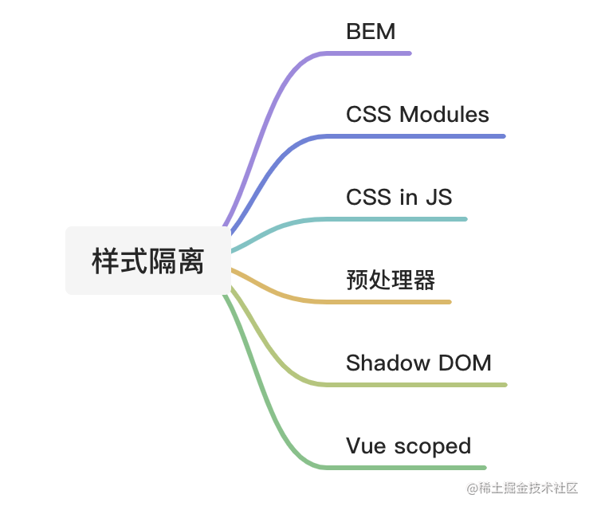
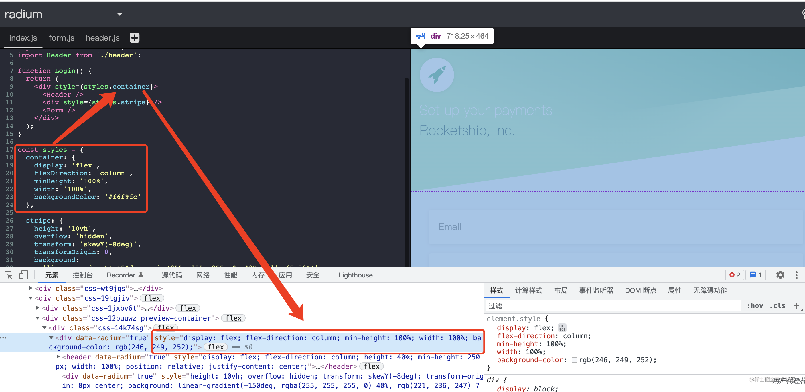
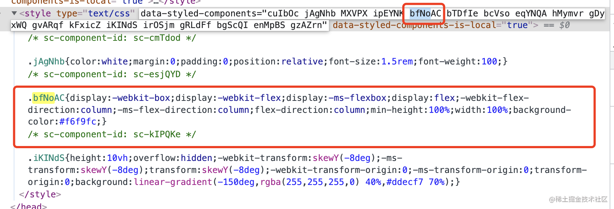

# css怎么实现样式隔离

参考答案：

> 本文主要讲css各种解决方案，包括，`BEM`、`css modules`、`Css in Js`、`预处理器`、`Shadow DOM`，`Vue Scoped`通过分析各项方案的**产生背景、带来的好处以及存在的一些问题**来帮助大家判断自己的`项目中适合使用哪种那方案`




预览


预览


## 零：CSS的原生问题

在讲解各种解决方案之前，我们先回顾下日常开发中我们遇到的css问题，待着这些问题，我们在讲解各种解决方案，并分析各个解决方案是否可以解决如下问题

### 0.1 无作用域样式污染

CSS有一个被大家诟病的问题就是`没有本地作用域`，所有声明的样式都是`全局的（global styles）`

换句话来说页面上任意元素只要匹配上某个选择器的规则，这个规则就会被应用上，而且规则和规则之间可以`叠加作用（cascading）`

`SPA应用`流行了之后这个问题变得更加突出了，因为对于SPA应用来说所有页面的样式代码都会加载到同一个环境中，样式冲突的概率会大大加大。由于这个问题的存在，我们在日常开发中会遇到以下这些问题：

- **很难为选择器起名字**：为了避免和页面上其他元素的样式发生冲突，我们在起选择器名的时候一定要深思熟虑，起的名字一定不能太普通。举个例子，假如你为页面上某个作为标题的DOM节点定义一个叫做`.title`的样式名，这个类名很大概率已经或者将会和页面上的其他选择器发生冲突，所以你不得不**手动**为这个类名添加一些前缀，例如`.home-page-title`来避免这个问题
- **团队多人合作困难**：当多个人一起开发同一个项目的时候，特别是多个分支同时开发的时候，大家各自取的选择器名字可能有会冲突，可是在本地独立开发的时候这个问题几乎发现不了。当大家的代码合并到同一个分支的时候，一些样式的问题就会随之出现

### 0.2 无用的CSS样式堆积

进行过大型Web项目开发的同学应该都有经历过这个情景：在开发新的功能或者进行代码重构的时候，由于`HTML代码和CSS样式之间没有显式的一一对应关系`，我们很难辨认出项目中哪些CSS样式代码是有用的哪些是无用的，这就导致了我们不敢轻易删除代码中可能是无用的样式。这样随着时间的推移，项目中的CSS样式只会增加而不会减少([append-only stylesheets](https://link.zhihu.com/?target=https%3A//css-tricks.com/oh-no-stylesheet-grows-grows-grows-append-stylesheet-problem/)）。无用的样式代码堆积会导致以下这些问题：

- **项目变得越来越重量级**：加载到浏览器的CSS样式会越来越多，会造成一定的性能影响
- **开发成本越来越高**：开发者发现他们很难理解项目中的样式代码，甚至可能被大量的样式代码吓到，这就导致了开发效率的降低以及一些奇奇怪怪的样式问题的出现

### 0.3 基于状态的样式定义

对于SPA应用来说，特别是一些交互复杂的页面，页面的样式通常要根据组件的状态变化而发生变化

最常用的方式是通过不同的状态定义不同的`className名`，这种方案代码看起来十分冗余和繁琐，通常需要同时改动`js代码和css代码`

> `这个CSS重写一遍比修改老文件快`，这样的念头几乎所有人都曾有过，css虽然看似简单，但是以上问题很容易写着写着就出现了，这在于提前没有选好方案

## 一、BEM

### 1.1 简介

BEM是`一种css命名方法论`，意思是块（Block）、元素（Element）、修饰符（Modifier）的简写

这种命名方法让[CSS](https://baike.baidu.com/item/CSS/5457)便于统一团队开发规范和方便维护

以 `.block__element--modifier`或者说`block-name__element-name--modifier-name`形式命名，命名有含义，也就是`模块名 + 元素名 + 修饰器名`

如`.dropdown-menu__item--active`

社区里面对BEM命名的褒贬不一，但是对其的思想基本上还是认同的，所以可以`用它的思想，不一定要用它的命名方式`

### 1.2 应用场景

BEM思想通常用于`组件库`，业务代码中`结合less等预处理器`

### 1.3 优缺点分析

#### 优点：

1. 人为严格遵守BEM规范，可以解决无作用域样式污染问题
2. 可读性好，一目了然是那个dom节点，对于无用css删除，删除了相应dom节点后，对应的css也能比较放心的删除，不会影响到其他元素样式

#### 缺点

1. 命名太长（个人开发习惯、部分人会觉得，我认为命名长提高了可读性，能解决一些问题，也不叫缺点），至于体积增大，gzip可忽略

> 个人比较喜欢BEM，其思想对编码好处远大于坏处，有兴趣的可以在项目中使用，更多可看[知乎：如何看待 CSS 中 BEM 的命名方式？](https://www.zhihu.com/question/21935157)

## 二、CSS modules

### 2.1 简介

什么是`CSS Modules`？

顾名思义，`css-modules 将 css 代码模块化`，可以避免`本模块样式被污染`，并且可以很方便的复用 css 代码

根据`CSS Modules`在Gihub上的[项目](https://github.com/css-modules/css-modules)，它被解释为：

> 所有的类名和动画名称默认都有各自的作用域的CSS文件。

所以`CSS Modules`既不是官方标准，也不是浏览器的特性，而是**在构建步骤（例如使用Webpack，记住css-loader）中对CSS类名和选择器`限定作用域`的一种方式**（类似于命名空间）

依赖`webpack css-loader`，配置如下，现在webpack已经默认开启CSS modules功能了

```
{
    test: /.css$/,
    loader: "style-loader!css-loader?modules"
}
```

我们先看一个示例：

将`CSS`文件`style.css`引入为`style`对象后，通过`style.title`的方式使用`title class`：

```
import style from './style.css';

export default () => {
  return (
    <p className={style.title}>
      I am KaSong.
    </p>
  );
};
```

对应`style.css`：

```
.title {
  color: red;
}
```

打包工具会将`style.title`编译为`带哈希的字符串`

```
<h1 class="_3zyde4l1yATCOkgn-DBWEL">
  Hello World
</h1>
```

同时`style.css`也会编译：

```
._3zyde4l1yATCOkgn-DBWEL {
  color: red;
}
```

这样，就产生了独一无二的`class`，解决了`CSS`模块化的问题

使用了 CSS Modules 后，就相当于给每个 class 名外加加了一个 `:local`，以此来实现样式的局部化，如果你想切换到全局模式，使用对应的 `:global`。

`:local` 与 `:global` 的区别是 CSS Modules 只会对 `:local` 块的 class 样式做 `localIdentName` 规则处理，`:global` 的样式编译后不变

```
.title {
  color: red;
}

:global(.title) {
  color: green;
}
```

可以看到，依旧使用CSS，但使用JS来管理样式依赖， 最大化地结合现有 CSS 生态和 JS 模块化能力，发布时依旧编译出单独的 JS 和 CSS

### 2.2 优缺点分析

#### 优点

- 能100%解决css无作用域样式污染问题
- 学习成本低：API简洁到几乎零学习成本

#### 缺点

- 写法没有传统开发流程，如果你不想频繁的输入 `styles.**`，可以试一下 [react-css-modules]([gajus/react-css-modules · GitHub](https://link.zhihu.com/?target=https%3A//github.com/gajus/react-css-modules))，它通过高阶函数的形式来避免重复输入 `styles.**`
- 没有变量，通常要结合预处理器
- 代码可读性差，hash值不方便debug

> css modules通常结合less等预处理器在react中使用，更多可参考[CSS Modules 详解及 React 中实践](https://zhuanlan.zhihu.com/p/20495964)

## 三、CSS in JS

### 3.1 简介

`CSS in JS`是2014年推出的一种**设计模式**，它的核心思想是`把CSS直接写到各自组件中`，也就是说`用JS去写CSS`，而不是单独的样式文件里

这跟传统的前端开发思维不一样，传统的原则是`关注点分离`，如常说的`不写行内样式`、`不写行内脚本`，如下代码

```
<h1 style="color:red;font-size:46px;"  onclick="alert('Hi')">
  Hello World
</h1>
```

`CSS-in-JS`不是一种很新的技术，可是它在国内普及度好像并不是很高，它当初的出现是因为一些`component-based`的`Web`框架（例如 `React`，`Vue` 和 `Angular`）的逐渐流行，使得开发者也想`将组件的CSS样式也一块封装到组件中去`以**解决原生CSS写法的一系列问题**

> CSS-in-JS在`React社区`的热度是最高的，这是因为React本身不会管用户怎么去为组件定义样式的问题，而Vue和Angular都有属于框架自己的一套定义样式的方案

上面的例子使用 `React` 改写如下

```
const style = {
  'color': 'red',
  'fontSize': '46px'
};

const clickHandler = () => alert('hi'); 

ReactDOM.render(
  <h1 style={style} onclick={clickHandler}>
     Hello, world!
  </h1>,
  document.getElementById('example')
);
```

上面代码在一个文件里面，封装了**结构、样式和逻辑**，完全`违背了"关注点分离"的原则`

但是，这`有利于组件的隔离`。每个组件包含了所有需要用到的代码，不依赖外部，组件之间没有耦合，很方便复用。所以，随着 React 的走红和组件模式深入人心，这种"`关注点混合`"的新写法逐渐成为主流

### 3.2 实现CSS in JS的库汇总

实现了`CSS-in-JS`的库有很多，[据统计](https://link.zhihu.com/?target=https%3A//github.com/MicheleBertoli/css-in-js)现在已经超过了61种。虽然每个库解决的问题都差不多，可是它们的实现方法和语法却大相径庭

从实现方法上区分大体分为两种：

- `唯一CSS选择器`，代表库：[styled-components](https://github.com/styled-components/styled-components)
- `内联样式`（Unique Selector VS Inline Styles）

不同的`CSS in JS`实现除了生成的`CSS样式和编写语法`有所区别外，它们实现的功能也不尽相同，除了一些最基本的诸如CSS局部作用域的功能，下面这些功能有的实现会包含而有的却不支持：

- 自动生成浏览器引擎前缀 - built-in vendor prefix
- 支持抽取独立的CSS样式表 - extract css file
- 自带支持动画 - built-in support for animations
- 伪类 - pseudo classes
- 媒体查询 - media query
- 其他

### 3.3 [styled-components](https://github.com/styled-components/styled-components)示例

[Styled-components](https://github.com/styled-components/styled-components) 是`CSS in JS`最热门的一个库了，到目前为止github的star数已经超过了`35k`

通过`styled-components`，可以使用ES6的[标签模板字符串](https://link.zhihu.com/?target=https%3A//developer.mozilla.org/en-US/docs/Web/JavaScript/Reference/Template_literals)语法（Tagged Templates）为需要`styled`的`Component`定义一系列`CSS`属性

当该组件的`JS代码被解析执行`的时候，`styled-components会动态生成一个CSS选择器`，并把对应的`CSS`样式通过`style`标签的形式插入到`head`标签里面。动态生成的`CSS`选择器会有一小段`哈希值来保证全局唯一性`来避免样式发生冲突

[CSS-in-JS Playground](https://link.zhihu.com/?target=https%3A//www.cssinjsplayground.com/)是一个可以快速尝试不同CSS-in-JS实现的网站，上面有一个简单的用`styled-components`实现表单的例子： 




从上面的例子可以看出，`styled-components`不需要你为需要设置样式的DOM节点设置一个`样式名`，使用完标签模板字符串定义后你会得到一个`styled`好的`Component`，直接在`JSX`中使用这个`Component`就可以了




 可以看到截图里面框出来的样式生成了一段`hash值`，实现了`局部CSS作用域`的效果（scoping styles），`各个组件的样式不会发生冲突`


### 3.4 [Radium](https://formidable.com/open-source/radium/)示例

```
Radium`和`styled-components`的最大区别是它生成的是`标签内联样式（inline styles）
```

由于标签内联样式在处理诸如`media query`以及`:hover`，`:focus`，`:active`等和浏览器状态相关的样式的时候非常不方便，所以`radium`为这些样式封装了一些标准的接口以及抽象

再来看一下`radium`在[CSS-in-JS Playground](https://www.cssinjsplayground.com/?activeModule=index&library=radium)的例子：


预览

 从上面的例子可以看出`radium`定义样式的语法和`styled-components`有很大的区别，它要求你使用`style`属性为`DOM`添加相应的样式


直接在标签内生成内联样式，内联样式相比于CSS选择器的方法有以下的优点： `自带局部样式作用域的效果`，无需额外的操作

### 3.5 CSS in JS 与"CSS 预处理器"（比如 Less 和 [Sass](https://www.ruanyifeng.com/blog/2012/06/sass.html)，包括 PostCSS）有什么区别

`CSS in JS` 使用 `JavaScript` 的语法，**是 JavaScript 脚本的一部分**，不用从头学习一套专用的 API，也不会多一道编译步骤，但是通常会在运行时动态生成CSS，造成一定运行时开销

### 3.6 优缺点分析

#### 优点

- **没有无作用域问题样式污染问题**

  通过唯一CSS选择器或者行内样式解决

- **没有无用的CSS样式堆积问题**

  CSS-in-JS会把样式和组件绑定在一起，当这个组件要被删除掉的时候，直接把这些代码删除掉就好了，不用担心删掉的样式代码会对项目的其他组件样式产生影响。而且由于CSS是写在JavaScript里面的，我们还可以利用JS显式的变量定义，模块引用等语言特性来追踪样式的使用情况，这大大方便了我们对样式代码的更改或者重构

- **更好的基于状态的样式定义**

  CSS-in-JS会直接将CSS样式写在JS文件里面，所以样式复用以及逻辑判断都十分方便

#### 缺点：

- **一定的学习成本**

- **代码可读性差**

  大多数CSS-in-JS实现会通过生成唯一的CSS选择器来达到CSS局部作用域的效果。这些自动生成的选择器会大大降低代码的可读性，给开发人员debug造成一定的影响

- **运行时消耗**

  由于大多数的CSS-in-JS的库都是在动态生成CSS的。这会有两方面的影响。首先你发送到客户端的代码会包括使用到的CSS-in-JS运行时（runtime）代码，这些代码一般都不是很小，例如styled-components的runtime大小是`12.42kB min + gzip`，如果你希望你首屏加载的代码很小，你得考虑这个问题。其次大多数CSS-in-JS实现都是在客户端动态生成CSS的，这就意味着会有一定的性能代价。不同的CSS-in-JS实现由于具体的实现细节不一样，所以它们的性能也会有很大的区别，你可以通过[这个工具](https://link.zhihu.com/?target=http%3A//necolas.github.io/react-native-web/benchmarks/)来查看和衡量各个实现的性能差异

- 不能结合成熟的CSS预处理器（或后处理器）Sass/Less/PostCSS，`:hover` 和 `:active` 伪类处理起来复杂

> 可以看到优点多，缺点也不少，选择需慎重，更多可阅读阮一峰老师写的[CSS in JS简介](http://www.ruanyifeng.com/blog/2017/04/css_in_js.html)，[知乎CSS in JS的好与坏](https://zhuanlan.zhihu.com/p/103522819)

## 四、预处理器

### 4.1 简介

**CSS 预处理器**是一个能让你通过预处理器自己独有的语法的程序

市面上有很多CSS预处理器可供选择，且绝大多数CSS预处理器**会增加一些原生CSS不具备的特性**，例如

- 代码混合
- 嵌套选择器
- 继承选择器

这些特性让CSS的结构`更加具有可读性且易于维护`

要使用CSS预处理器，你必须在web服务中安装CSS`编译工具`

我们常见的预处理器：

- [Sass](https://sass-lang.com/)
- [LESS](https://lesscss.org/)
- [Stylus](http://stylus-lang.com/)
- [PostCSS](http://postcss.org/)

### 4.2 优缺点分析

#### 优点：

1. 利用嵌套，人为严格遵守嵌套首类名不一致，可以解决无作用域样式污染问题
2. 可读性好，一目了然是那个dom节点，对于无用css删除，删除了相应dom节点后，对应的css也能比较放心的删除，不会影响到其他元素样式

#### 缺点

1. 需要借助相关的编译工具处理

> 预处理器是现代web开发中必备，`结合BEM规范`，利用预处理器，可以极大的`提高开发效率，可读性，复用性`

## 五、Shadow DOM

### 5.1 简介

熟悉`web Components`的一定知道`Shadow DOM`可以实现样式隔离，由浏览器原生支持 


预览


我们经常在微前端领域看到`Shadow DOM`，如下创建一个子应用

```
1const shadow = document.querySelector('#hostElement').attachShadow({mode: 'open'});
2shadow.innerHTML = '<sub-app>Here is some new text</sub-app><link rel="stylesheet" href="//unpkg.com/antd/antd.min.css">';
```

由于子应用的样式作用域仅在 `shadow` 元素下，那么一旦子应用中出现运行时越界跑到外面构建 DOM 的场景，必定会导致构建出来的 DOM 无法应用子应用的样式的情况。

比如 `sub-app` 里调用了 `antd modal` 组件，由于 `modal` 是动态挂载到 `document.body` 的，而由于 `Shadow DOM` 的特性 `antd` 的样式只会在 `shadow` 这个作用域下生效，结果就是弹出框无法应用到 `antd` 的样式。解决的办法是把 `antd` 样式上浮一层，丢到主文档里，但这么做意味着子应用的样式直接泄露到主文档了

### 5.2 优缺点分析

#### 优点

- 浏览器原生支持
- 严格意义上的样式隔离，如iframe一样

#### 缺点

- 浏览器兼容问题
- 只对一定范围内的dom结构起作用，上面微前端场景已经说明

> 普通业务开发我们还是用框架、如Vue、React；Shadow DOM适用于特殊场景，如微前端

## 六、vue scoped

当 `<style>` 标签有 `scoped` 属性时，它的 `CSS` 只作用于当前组件中的元素

通过使用 `PostCSS` 来实现以下转换：

```
<style scoped>
.example {
  color: red;
}
</style>

<template>
  <div class="example">hi</div>
</template>
```

转换结果：

```
<style>
.example[data-v-f3f3eg9] {
  color: red;
}
</style>

<template>
  <div class="example" data-v-f3f3eg9>hi</div>
</template>
```

使用 `scoped` 后，**父组件的样式将不会渗透到子组件中**

不过一个子组件的根节点会同时受其父组件的 scoped CSS 和子组件的 scoped CSS 的影响。这样设计是为了让父组件可以从布局的角度出发，调整其子组件根元素的样式，父租价利用`深度作用选择器`影响子组件样式

可以使用 `>>>` 操作符：

```
<style scoped>
.a >>> .b { /* ... */ }
</style>
```

上述代码将会编译成：

```
.a[data-v-f3f3eg9] .b { /* ... */ }
```

有些像 `Sass` 之类的预处理器无法正确解析 `>>>`。这种情况下你可以使用 `/deep/` 或 `::v-deep` 操作符取而代之——两者都是 `>>>` 的别名，同样可以正常工作

## 总结

六种方案对比如下，社区通常的样式隔离方案，以下两种

- `BEM+预处理器`

- ```
  CSS Moduls + 预处理器
  ```

   

  

  预览