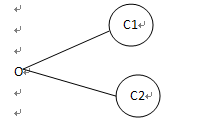

# 软件测试理论

## 一、什么是软件测试(测试定义)
用尽一切可能的方法和工具，查找出软件中存在的错误，保证软件质量符合预期要求，为产品树立可靠信心的手段。

## 二、为什么要测试
1、按照需求，查找中软件中存在的bug并且改正
2、为软件上线树立信心
3、将问题汇总成报告报给项目经理，让他去抉择项目是否按工期达到上线要求

##  三、测试分类（按开发阶段）

### 1、单元测试：

1.1、测试阶段：编写代码前后
1.2、测试对象：模块
1.3、测试人员：白盒测试工程师或开发人员。
1.4、测试方法：白盒测试
1.5、测试内容：对每个接口、方法、函数逐个进行测试。

### 2、集成测试：

2.1、测试阶段：单元测试之后。
2.2、测试对象：模块间的接口
2.3、测试人员：白盒测试工程师或开发人员。
2.4、测试方法：白盒测试
25、 测试内容：多模块联合测试。

### 3、系统测试：

3.1、测试阶段：集成测试阶段之后。
3.2、测试对象：整个系统（整个项目）
3.3：测试人员：黑盒测试工程师
3.4：测试方法：黑盒测试
3.5：测试内容：功能性测试、性能测试、兼容性测试、安全性测试

### 4、验收测试：

4.1、测试阶段：系统测试通过后
4.2、测试对象：整个系统（整个项目）
4.3、测试人员：最终用户或者需求方（甲方）
4.4、测试方法：黑盒测试
4.5、测试内容：实用性测试。
冒烟测试：是指一个新版本进行大规模的系统测试之前，先验证软件的基本功能是否实现。（重要）
回归测试：是指修改了旧代码之后，重新测试以确认修改后有没有引入新的错误或者导致其他代码产生错误。（重要）
随机测试：是指输入的数据都是随机产生的，其目的是模拟用户的真实操作，发现边缘性问题。
探索性测试：抛开测试计划和测试用例、碰到问题时及时改变测试策略。
猴子测试：把自己当白痴、随便乱点进行测试。
测试顺序：冒烟–>系统(随机、探索、猴子)–>回归–>冒烟
α测试：是由一个用户在开发环境下进行的测试
β测试：由一个或多个用户在一个或多个场所下对仿真环境下进行测试。

## 四、测试类型

1、功能性测试：按照需求，对每个功能点进行测试
2、性能测试：通过对功能点的压力进行测试
3、安全性测试：针对软件中存在的漏洞或常见的漏洞进行测试（常见的漏洞：SQL注入）
4、兼容性测试：一个软件可以在多个浏览器（Chrome、火狐、IE8+）中正常使用、或不同型号手机等等。

## 五、测试的方法

1、黑盒测试：只关注功能是否满足用户要求，不关注功能点的内部结构（代码）
2、白盒测试：关注内部结构（单元性测试）
3、灰盒测试：即关注功能点是否满足用户需求，又关注内部结构
4、动态测试：即关注页面情况，又关注接口情况
5、静态测试：只关注页面
6、手工测试：手动测试
7、自动化测试：编代码测试

## 六、软件的生命周期

立项—>需求分析—>设计，编码，测试—>发布—>运行维护—>淘汰

## 七、测试的生命周期

需求分析–>测试计划–>测试设计–>测试执行—>测试评估—>测试结束
1、需求分析阶段：测试人员了解需求、对需求进行分解、分析，得出测试需求。
2、测试计划阶段：根据需求编写测试计划/测试方案
3、测试设计、测试开发阶段：测试人员适当的了解设计，对于设计测试用例是很有帮助的，测试人员搭建测试用例框架，根据需求和设计编写一部分测试用例。
4、测试执行阶段：测试执行阶段是软件测试人员最为重要的工作阶段，根据测试用例和计划执行测试。
5、测试评估阶段：在执行的过程中记录、管理缺陷，测试完成后编写测试报告，进行测试评估。
6、是否所有用例被执行，查看禅道是否还有激活状态的bug。

## 八、测试计划

测试经理定义测试计划、主要定义（测试范围、测试策略、资源安排、进度安排、发布标准、风险预防）

## 九、测试方案

测试经理定义具体内容参考连接
https://blog.csdn.net/alice_tl/article/details/80218342

## 十、测试策略

测试经理定义测试策略，主要就是描述某模块需要进行什么样的测试。

## 十一、需求呈清

项目经理进行需求呈清

## 十二、什么是测试用例

一组由前提条件、输入、执行条件、预期结果等组成，以完成对某个特定需求测试的数据，体现测试方案，方法，技术和策略的文档

## 十三、为什么需要写测试用例

能够有效的对测试步骤进行组织规划，方便管理，记录

## 十四、测试用例内容主要包含哪些内容

编号、日期、设计和测试人员、优先级、标题、目标、环境、输入数据/动作、预期结果

## 十五、编写测试用例需要什么资料

软件需求设计说明书、软件模板(页面模型)

## 十六、设计测试用例的注意事项

从高到低，独立性，与功能一一对应，根据需求设计，由有经验的人员设计

## 十七、设计测试的原则

有模板，正确性，代表性，重现性，可判断性，详细准确清晰的步骤，符合规范

## 十八、测试用例的管理工具

禅道，QC，Test Director、Excel

## 十九、测试用例的管理过程

编写→评审（修改→再次评审）→使用→保存管理→维护/升级

## 二十、测试用例设计的几种方式

1、等价类：具有相同意义的集合，集合中一个个体可以代表其他个体的意义
1.1、等价类分为有效等价类和无效等价类
举例：需求为用户名长度在6-18位，小于6位大于18位皆为无效，6-18位之间皆为有效
1.2、有效类的划分方法：1、一个有效一个无效
1.3、一个有效多个无效（从多方面考虑假的状态）
1.4、多个有效一个无效（集合范围内是有效，范围外无效）
集合：1个物品以上的总和叫集合
2、边界值：需求定义的范围 例:(用户名长度在6-18位)
边界值分为：
2.1、边界点 （最小值 最大值 6 18）
2.2、离点 （略低于最小值 略高于最大值 5 19）
2.3、内点 （略高于最小值 略低于最大值 7 17）
3、判定表：在多个条件下，每个条件都会触发不同的结果，每个条件只能有两种情况
判定表定义：
条件
3.1、条件桩：分析需求所有条件
3.2、条件项：条件的值
动作
3.3、动作桩：根据条件可能导致的动作
3.4、动作项：在不同条件下采取的操作
规则：有不同条件导致不同动作
判定表的优缺点：
优点：把复杂的问题按各种可能的情况一一举例，简明易于理解，也避免遗漏
缺点：不能表达重复执行的动作，如循环结构
判定表不能很好的伸缩，如有n个条件有2n个规则

四、因果图
输入与输出的关系主要有：恒等、非、与、或
恒等：若输入条件发生，则一定会产生对应的输出，若输入条件不发生，则一定不会产生对应的输出

非：若输入条件发生，则一定不会产生对应的输出，若输入条件不发生，一定会产生对应的输出

与：多个输入条件，只有所有输入条件发生时，才会产生对应的输出

或：在多个输入条件中，只要有一个发生，则会产生对应输出

输入与输入之间同样存在异、或、唯一、要求等4种关系
异（所有输入条件中至多有一个发生，可以一个条件条件也不发生）

或（所有输入条件至少有一个输入条件发生，也可以多个条件共存）

唯一（所有输入条件有且只有一个发生）

要求（所有输入条件中只要有一个条件发生，其他的输入也会发生）

因果图的优点：
1、因果图法能够帮助我们按一定的步骤高效选择测试用例，设计多个输入条件组合用例
2、因果图分析还能为我们指出软件规格说明描述中存在的问题
因果图的缺点：
1、输入条件与输出结果的因果关系，有时难以从软件需求规格说明书得到
2、即使得到了这些因果关系，也会因为因果关系复杂导致因果图非常庞大，测试用例数目及其庞大

因果图法测试用例的设计步骤
1、确定软件规格中的原因和结果
2、确定原因和结果之间的逻辑关系
3、确定因果图中的各个约束
4、画出因果图并转换为决策表
5、根据决策表设计测试用例

## 二十一、测试应用：APP测试

APP测试：安装/卸载、消息推送、弱网测试（2G、3G、4G、5G、WIFI）、场景交互测试（来电、听音乐、使用相机、前后台切换）、权限测试、离线测试

## 二十二、BUG的定义：
为了发现错误而执行程序的过程

## 二十三、BUG的分类：

1、代码错误
2、设计缺陷
3、界面优化
4、性能问题
5、配置相关
6、安装部署
7、安全相关
8、标准规范
9、测试脚本
10、其他划分：功能类、界面类、性能类、易用性类、兼容性类、其他

## 二十四、BUG的六要素：

编号、用例号（输入，期望输出）、现象描述，测试日期时间、测试人、重现或重现的概率

## 二十五、BUG的生命周期：

新建–>指派–>接受–>修复–>关闭

## 二十六、BUG的状态

新建：测试人员新提交的bug、优化或者建议的问题状态；
进行中：开发人员已确认是bug，需要修改的问题状态；
已解决：开发人员已修复的问题状态；
已关闭：测试验证，确定已解决的问题状态；
已拒绝：开发认为不是bug，拒绝给测试的问题状态；
反馈：反馈给产品确认的问题状态；
公认：确认是bug，但是无法解决的问题状态；
打回：测试验证已解决bug，仍然没有修复的问题状态；

## 二十七、BUG的优先级

低：对产品的影响比较小，在时间不允许的情况下可以暂时不修改；
中：必须修改，不一定马上修改，需讨论确定在某个特定的里程碑前修改完；
高：必须在版本发布之前修改完；
紧急：影响测试，需立即或者下一个版本修复；

## 二十八、BUG的严重程度

致命：不能执行正常的功能操作，或者因产品原因导致系统死机，需马上修复的问题
示例：
程序无法启动，或者登录；
程序崩溃、停止运行，系统死机，无法进行下一步的操作
严重：部分功能存在严重缺陷，尚可继续测试，不影响产品稳定性；
示例：
偶现的程序崩溃、停止运行
功能未实现
数据不同步
功能错误，无法进行后续操作
一般：次要功能或者界面存在的一些错误，不影响正常测试；
示例：
界面UI显示和效果图不一致；
提示语不正确；
错别字；
查询结果显示错误
建议：测试对于产品的一些改进建议；

## 二十九、BUG的管理工具

禅道 QC、 Trello

## 三十、测试总结阶段（测试报告）

对工作的总结、对bug的统计（测试、开发、软件模块、等级、解决的时间、每个版本、状态）、对被测试软件质量的评估

## 三十一、用户使用手册

参考模板：
https://wenku.baidu.com/view/af40af7401f69e3143329449.html
编写对象：测试人员或业务人员
编写目的：让用户更清楚的了解系统

## 三十二、测试报告

参考模板：
https://wenku.baidu.com/view/475ac346ba68a98271fe910ef12d2af90242a8a2.html
https://wenku.baidu.com/view/e0051ac943323968001c92e9.html?rec_flag=default
编写对象：测试人员
编写目的：记录测试过程，总结各轮次的测试情况，分析测试数据，归纳测试工作进行过程中暴露的问题与遗留的风险，给出相应的测试建议以供后续项目参考。

## 三十三、测试周报

参考文档：https://www.jianshu.com/p/0bc09894e78a

## 三十四、测试和开发流程的关系、瀑布流、V字形、W字型，敏捷测试
参考这个视频：
https://www.bilibili.com/video/av57464686/?p=2

## 三十五、5W2H、戴明环（PDCA）
WHAT——是什么？目的是什么？做什么工作？

WHY——为什么要做？可不可以不做？有没有替代方案？
WHO——谁？由谁来做？
WHEN——何时？什么时间做？什么时机最适宜？
WHERE——何处？在哪里做？
HOW ——怎么做？如何提高效率？如何实施？方法是什么？
HOW MUCH——多少？做到什么程度？数量如何？质量水平如何？费用产出如何？
戴明环：
计划（Plan） 执行（do） 检查（check） 处理（Act）
https://baike.baidu.com/item/PDCA%E5%BE%AA%E7%8E%AF/5091521?fromtitle=%E6%88%B4%E6%98%8E%E7%8E%AF&fromid=9497097&fr=aladdin

## 三十六、App测试的特性，Web测试特性
参考：
https://www.cnblogs.com/yinrw/p/9449519.html
具体流程参考：
https://zhuanlan.zhihu.com/p/32505591

## 三十七、没有需求怎么办？ 

参考市面上已经成熟的同类型的产品的实现
————————————————
版权声明：本文为CSDN博主「杨晨同志」的原创文章，遵循CC 4.0 BY-SA版权协议，转载请附上原文出处链接及本声明。
原文链接：https://blog.csdn.net/ccxiaojiejie/article/details/102399708