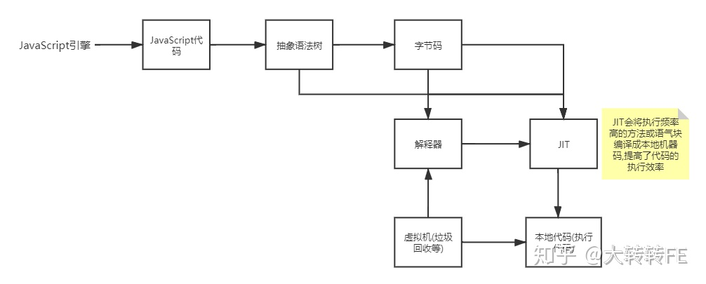
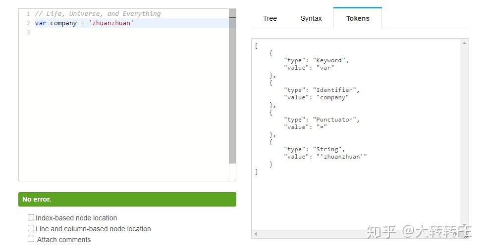

# AST详解与运用

了解AST之前,我们先来简单陈述一下JavaScript引擎的工作原理:



从上图中我们可以看到,JavaScript引擎做的第一件事情就是把JavaScript代码编译成抽象语法树,于是就有了本文对AST抽象语法树的浅析.

## **一、什么是AST抽象语法树**

我们都知道,在传统的编译语言的流程中,程序的一段源代码在执行之前会经历三个步骤,统称为"编译":

- 分词/词法分析
  这个过程会将由字符组成的字符串分解成有意义的代码块,这些代码块统称为**词法单元**(token).
  举个例子: let a = 1, 这段程序通常会被分解成为下面这些词法单元: let 、a、=、1、 ；空格是否被当成此法单元，取决于空格在这门语言中的意义。
- 解析/语法分析
  这个过程是将词法单元流转换成一个由元素嵌套所组成的代表了程序语法结构的树,这个树被称为"**抽象语法树**"（abstract syntax code，AST）
- 代码生成
  将AST转换成可执行代码的过程被称为代码生成.

**抽象语法树**（abstract syntax code，AST）是源代码的抽象语法结构的树状表示，树上的每个节点都表示源代码中的一种结构，之所以说是抽象的，抽象表示把js代码进行了结构化的转化，转化为一种数据结构。这种数据结构其实就是一个大的json对象，json我们都熟悉，他就像一颗枝繁叶茂的树。有树根，有树干，有树枝，有树叶，无论多小多大，都是一棵完整的树。

简单理解,就是把我们写的代码按照一定的规则转换成一种树形结构。

## **二、AST的用途**

AST的作用不仅仅是用来在JavaScript引擎的编译上，我们在实际的开发过程中也是经常使用的，比如我们常用的babel插件将 ES6转化成ES5、使用 UglifyJS来压缩代码 、css预处理器、开发WebPack插件、Vue-cli前端自动化工具等等，这些底层原理都是基于AST来实现的，AST能力十分强大， 能够帮助开发者理解JavaScript这门语言的精髓。

## **三、AST的结构**

我们先来看一组简单的AST树状结构:

```text
const team = '大转转FE'
```

经过转化,输出如下AST树状结构:

```text
{
  "type": "Program",
  "start": 0,
  "end": 18,
  "body": [
    {
      "type": "VariableDeclaration",
      "start": 0,
      "end": 18,
      "declarations": [
        {
          "type": "VariableDeclarator",
          "start": 6,
          "end": 18,
          "id": {
            "type": "Identifier",
            "start": 6,
            "end": 8,
            "name": "team"
          },
          "init": {
            "type": "Literal",
            "start": 11,
            "end": 18,
            "value": "大转转FE",
            "raw": "'大转转FE'"
          }
        }
      ],
      "kind": "const"
    }
  ],
  "sourceType": "module"
}
```

我们可以看到，一个标准的AST结构可以理解为一个json对象，那我们就可以通过一些方法去解析和操作它，这里我们先提供一个在线检测工具,大家可以自行去体验: [https://esprima.org/demo/parse.html#](https://link.zhihu.com/?target=https%3A//esprima.org/demo/parse.html%23)

## **四、AST编译过程**

AST编译流程图:


我们可以看到,AST工具会源代码经过四个阶段的转换：

## **1.词法分析scanner**

```text
var company = 'zhuanzhuan'
```

假如有以上代码，在词法分析阶段，会先对整个代码进行扫描，生成tokens流，扫描过程如下：

- 我们会通过条件判断语句判断这个字符是 字母， "/" , "数字" , 空格 , "(" , ")" , ";" 等等。
- 如果是字母会继续往下看如果还是字母或者数字，会继续这一过程直到不是为止，这个时候发现找到的这个字符串是一个 "var"， 是一个Keyword，并且下一个字符是一个 "空格"， 就会生成{ "type" : "Keyword" , "value" : "var" }放入数组中。
- 它继续向下找发现了一个字母 'company'(因为找到的上一个值是 "var" 这个时候如果它发现下一个字符不是字母可能直接就会报错返回)并且后面是空格，生成{ "type" : "Identifier" , "value" : "company" }放到数组中。
- 发现了一个 "=", 生成了{ "type" : "Punctuator" , "value" : "=" }放到了数组中。
- 发现了'zhuanzhuan',生成了{ "type" : "String" , "value" : "zhuanzhuan" }放到了数组中。
  解析如下：



## **2.parser生成AST树**

这里我们使用**esprima**去生成, 安装相关依赖 npm i esprima --save

以如下代码为例:

```text
const company = 'zhuanzhuan'
```

要得到其对应的AST,我们对其进行如下操作:

```text
const esprima = require('esprima');
let code = 'const company = "zhuanzhuan" ';
const ast = esprima.parseScript(code);
console.log(ast);
```

运行结果如下:

```text
$ node test.js
Script {
  type: 'Program',
  body: [
    VariableDeclaration {
      type: 'VariableDeclaration',
      declarations: [Array],
      kind: 'const'
    }
  ],
  sourceType: 'script'
}
```

这样我们就得到了一棵AST树

## **3.traverse对AST树遍历,进行增删改查**

这里我们使用**estraverse**去完成, 安装相关依赖 npm i estraverse --save

还是上面的代码, 我们更改为 **const team = '大转转FE'**

```text
const esprima = require('esprima');
const estraverse = require('estraverse');
let code = 'const company = "zhuanzhuan" ';
const ast = esprima.parseScript(code);
estraverse.traverse(ast, {
    enter: function (node) {
     node.name = 'team';
        node.value = "大转转FE";
    }
});
console.log(ast);
```

运行结果如下:

```text
$ node test.js
Script {
  type: 'Program',
  body: [
    VariableDeclaration {
      type: 'VariableDeclaration',
      declarations: [Array],
      kind: 'const',
      name: 'team',
      value: '大转转FE'
    }
  ],
  sourceType: 'script',
  name: 'team',
  value: '大转转FE'
}
```

这样一来,我们就完成了对AST的遍历更新。

## **4.generator将更新后的AST转化成代码**

这里我们使用**escodegen**去生成, 安装相关依赖 npm i escodegen --save

整体代码结构如下:

```text
const esprima = require('esprima');
const estraverse = require('estraverse');
const escodegen = require('escodegen');
let code = 'const company = "zhuanzhuan" ';
const ast = esprima.parseScript(code);
estraverse.traverse(ast, {
    enter: function (node) {
     node.name = 'team';
        node.value = "大转转FE";
    }
});
const transformCode = escodegen.generate(ast);
console.log(transformCode);
```

会得到如下结果:

```text
$ node test.js
const team = '大转转FE';
```

这样一来,我们就完成了对一段简单代码的AST编译过程。

## **五、babel原理浅析**

**Babel插件就是作用于抽象语法树。**

Babel 的三个主要处理步骤分别是： 解析（parse），转换（transform），生成（generate）。

- **解析**
  将代码解析成抽象语法树（AST），每个js引擎（比如Chrome浏览器中的V8引擎）都有自己的AST解析器，而Babel是通过Babylon([https://github.com/babel/babylon](https://link.zhihu.com/?target=https%3A//github.com/babel/babylon))实现的。解析过程有两个阶段：**词法分析**和**语法分析**，词法分析阶段把字符串形式的代码转换为**令牌**（tokens）流，令牌类似于AST中节点；而语法分析阶段则会把一个令牌流转换成 AST的形式，同时这个阶段会把令牌中的信息转换成AST的表述结构。
- **转换**
  转换步骤接收 AST 并对其进行遍历，在此过程中对节点进行添加、更新及移除等操作。 Babel通过**babel-traverse**对其进行深度优先遍历，维护AST树的整体状态，并且可完成对其的替换，删除或者增加节点，这个方法的参数为原始AST和自定义的转换规则，返回结果为转换后的AST。
- **生成**
  **[代码生成](https://link.zhihu.com/?target=https%3A//en.wikipedia.org/wiki/Code_generation_(compiler))**步骤把最终（经过一系列转换之后）的 AST 转换成字符串形式的代码，同时还会创建源码映射（source maps）([http://www.html5rocks.com/en/tutorials/developertools/sourcemaps/](https://link.zhihu.com/?target=http%3A//www.html5rocks.com/en/tutorials/developertools/sourcemaps/))。.
  代码生成其实很简单：深度优先遍历整个 AST，然后构建可以表示转换后代码的字符串。
  Babel通过**babel-generator**再转换成js代码，过程就是深度优先遍历整个AST，然后构建可以表示转换后代码的字符串。

## **六、vue中AST抽象语法树的运用;**

vue中AST主要运用在**模板编译**过程.

我们先来看看vue模板编译的整体流程图：


vue中的模板编译主要分为三个步骤:

1. 解析器阶段: 将 template 里面的代码解析成AST抽象语法树;
2. 优化器阶段: 将AST抽象语法树静态标签打上tag,防止重复渲染(优化了diff算法);
3. 代码生成器阶段: 优化后的AST抽象语法树通过generate函数生成render函数字符串；

我们来看看vue源码的整体实现过程:

```text
export const createCompiler = createCompilerCreator(function baseCompile (
  template: string,
  options: CompilerOptions
): CompiledResult {
  //生成ast的过程                                                 
  const ast = parse(template.trim(), options)
  //优化ast的过程,给ast抽象语法树静态标签打上tag,防止重复渲染
  if (options.optimize !== false) {
    optimize(ast, options)
  }
  //通过generate函数生成render函数字符串
  const code = generate(ast, options)
  return {
    ast,
    render: code.render,
    staticRenderFns: code.staticRenderFns
  }
})
```

解析器要实现的功能就是将模板解析成**AST**，我们这里主要来分析一下代码解析阶段，这里主要运用的是**parse()这个函数,事实上,解析器内部也分为好几个解析器,比如HTML解析器**、**文本解析器**以及**过滤解析器**，其中最主要的就是HTML解析器。HTML解析器的作用就是解析HTML，它在解析HTML的过程中会不断触发各种钩子函数，我们来看看代码实现：

```text
parseHTML(template, { 
 //解析开始标签
 start (tag, attrs, unary, start, end) {

    },
    //解析结束标签
     end (tag, start, end) {

    },
    //解析文本
 chars (text: string, start: number, end: number) {

    },
    //解析注释
    comment (text: string, start, end){

    }
})
```

举个例子:

```text
<div>我们是大转转FE</div>
```

当上面这个模板被HTML解析器解析时,所触发的钩子函数依次是: **start**、**chars**、**end**。

所以HTML解析器在实现上是一个函数，它有两个参数----模板和选项，我们的模板是一小段一小段去截取与解析的，所以需要不断循环截取，我们来看看vue内部实现原理：

```text
function parseHTML (html, options) {
 while (html) {
    //判断父元素为正常标签的元素的逻辑
   if (!lastTag || !isPlainTextElement(lastTag)) {
     //vue中要判断是 文本、注释、条件注释、DOCTYPE、结束、开始标签
     //除了文本标签， 其他的都是以 < 开头, 所以区分处理
     var textEnd = html.indexOf('<');
        if (textEnd === 0) {
         //注释的处理逻辑
         if (comment.test(html)) {}
         //条件注释的处理逻辑
         if (conditionalComment.test(html)) {}
         //doctype的处理逻辑
         var doctypeMatch = html.match(doctype);
                if (doctypeMatch) {}
                //结束标签的处理逻辑
                var endTagMatch = html.match(endTag);
                if (endTagMatch) {}
                //开始标签的处理逻辑
                var startTagMatch = parseStartTag();
                if (startTagMatch) {}
        }
        
             var text = (void 0), rest = (void 0), next = (void 0);
             //解析文本
             if (textEnd >= 0) {}
             // "<" 字符在当前 html 字符串中不存在
             if (textEnd < 0) {
                text = html
                html = ''
              }
              // 如果存在 text 文本
              // 调用 options.chars 回调，传入 text 文本
             if (options.chars && text) {
               // 字符相关回调
               options.chars(text)
             }
   }else{
    // 父元素为script、style、textarea的处理逻辑
   }
 }
}
```

以上就是vue解析器生成AST语法树的主流程了，代码细节的地方还需要自己去解读源码，源码位置:**\vue\packages\weex-template-compiler\build.js**

## **结语：**

AST抽象语法树的知识点作为JavaScript中(任何编程语言中都有ast这个概念,这里就不过多赘述)相对基础的，也是最不可忽略的知识，带给我们的启发是无限可能的，它就像一把螺丝刀，能够拆解javascript这台庞大的机器，让我们能够看到一些本质的东西，同时也能通过它批量构建任何javascript代码。

小时候梦想改变世界，如今我们可以用自己写的程序，构建出我们所生活的网络世界，丰富多姿。

借用一句歌词: 我还是从前那个少年，没有一丝丝改变。时间只不过是考验，种在心中信念丝毫未减 。希望大家能够在软件开发的路途上坚定信念，越走越远.....

 (未完待续)

## **参考文献**

[1]朱永盛. WebKit 技术内幕[M]. 电子工业出版社

[2] [美] KYLE SIMPSON. 你不知道的JavaScript(上卷)[M]. 人民 邮电出版社

[3] 月影. 深入浅出Vue.js[M]. 人民邮电出版社

[4] V8引擎详解-AST [https://juejin.im/post/6844904146798116871](https://link.zhihu.com/?target=https%3A//juejin.im/post/6844904146798116871)

[5] Babel插件手册 [https://github.com/jamiebuilds/](https://link.zhihu.com/?target=https%3A//github.com/jamiebuilds/babel-handbook/blob/master/translations/zh-Hans/plugin-handbook.md%23toc-stages-of-babel)