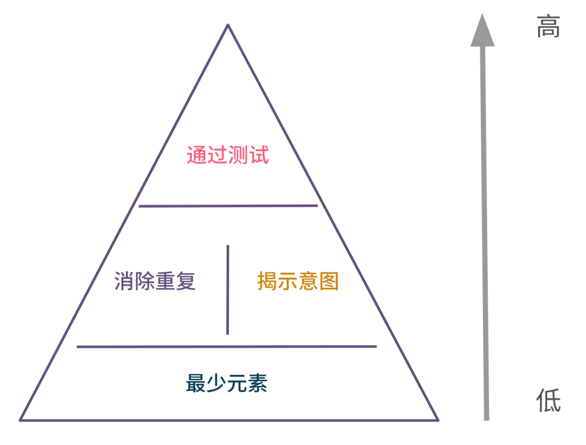
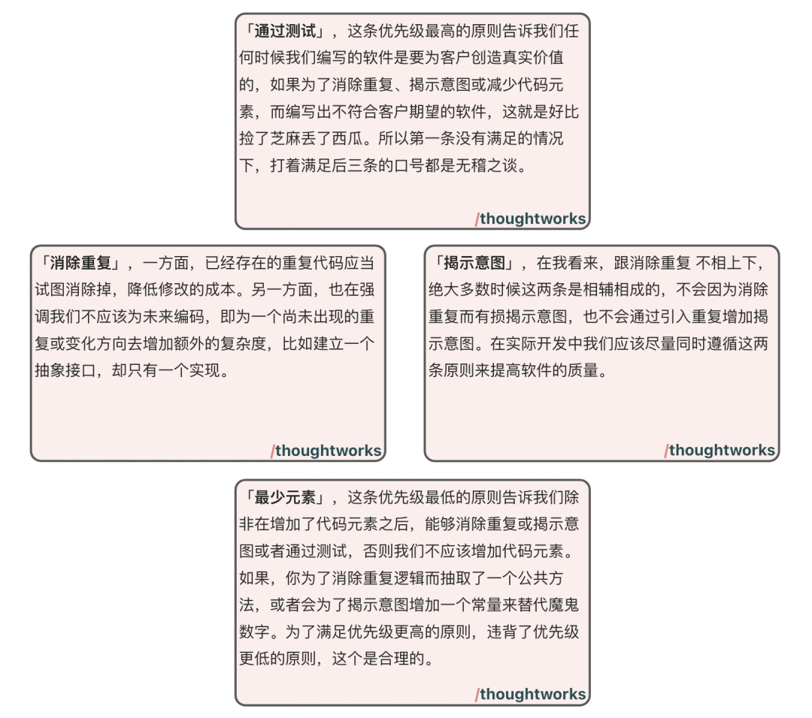
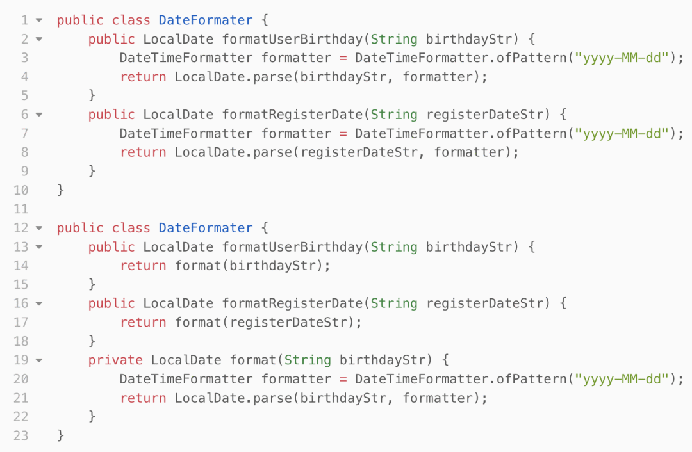
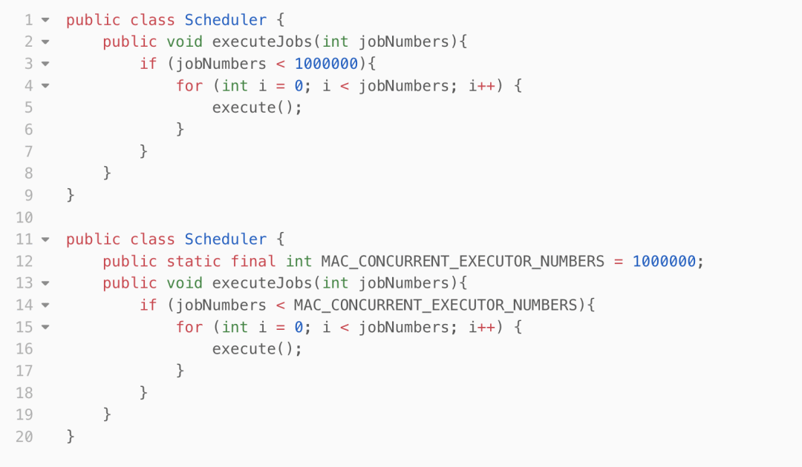

# 代码的简单设计五原则

欢欢：“你看我的代码用了策略模式和状态模式，假如后面客户会有这样的需求，可以无缝扩展，多么健壮！” 清扬一脸狐疑，心中念叨了数遍 ：“哼，过度设计！”，只见她欲言又止，好几次话到嘴边又被自己咽回去了。

这种关于设计的讨论，袁帅最近一周不是第一次听到了，就在昨天他还看到清扬和正义的一次口水仗。最近清扬有点仕途不顺，几次被结对的搭档怼得无言以对。袁帅想为他的Buddy清扬“讨回公道”，但不是直接出面帮清扬怼回去。

**设计的标准在哪里？**

周五下午，公司内部的敏捷工程实践指导手册上醒目的三条价值观的「**简单性**」让袁帅陷入了沉思：

**简单性：我们重视刚刚够用的设计。只为当下设计，不为未来可能出现的需求做设计。但是，我们做出的决策应当允许软件快速变更，能够快速响应需求变化。**

「简单性」，看起来也似乎明白在讲什么，可什么是刚刚够用的设计呢？这句话让他想起来当年他在一次面向对象训练营的课后跟某个学员说过的一句话：“设计犹如西红柿炒鸡蛋，盐要恰到好处。” 这句话是如此的正确却又无比空洞。

设计的好坏本身没有一个标准的答案，这么多年，袁帅也在跟着软件界各路神仙学习设计原则，仍然处在似懂非懂的状态。他也深知每个人心中都有一杆秤。**什么是好的设计？**便成了公说公有理，婆说婆有理的问题，谁也难以说服谁。

这一次他不太想提那些空空如也的东西，为了能够让清扬快速掌握要点，他尝试将范围缩小到敏捷团队程序员交付用户故事卡时的编码设计，避开架构设计。从变量、常量、方法、类、类与类之间的关系、对象的交互开始。

**重温旧文：简单设计**

周六，袁帅很早就钻到书房，点燃背景音乐《稻香》，打开博客主页，发现了一篇多年前写的文章《简单设计》，仔细通读一遍之后，他觉得还不错，可以作为入门，发给清扬阅读，约下周一大一早去公司讨论。

他花了近一个小时将文字润色，也基于最近对设计的体会调整了部分内容，保留了文章的整体脉络。

**用具体的词汇表达设计**

抽象的设计问题大大提升了初学者的学习门槛，想得太多怕被说过度设计，吃饱撑着没事找事。想少了，又怕被人认为能力不足，无脑编码。到底怎么办，怎么样才能做出好的设计？SOLID、GoF的23种设计模式、STUPID、GRASP这些原则学会了就可以了吗？No，统统忘掉这些抽象不接地气的设计原则。

起步，尽量别为难自己。极限编程领域的大师程序员Kent Beck很早前就提出了4条相对容易理解的参考原则：

**原则一：通过测试（信仰）**

**「通过测试」** 通常会被一概地理解为通过自己在项目中的各种测试（自动化 + 手工），这么理解，也没有什么问题，但是需要满足两个前提条件：

1. 测试覆盖率达到100%
2. 所有测试都是有效的

如果你的项目中没法满足这两点，当然，99%的项目是做不到的（还有1%存在传说中）。此时你需要换一个角度去理解 *通过测试*。

你为什么写测试？测试在测什么？不就是为了增强你对系统功能是否满足了业务需求的信心吗？所以「**通过测试** 」广义理解为要满足业务需求，不论是自动化测试还是手工测试，你需要做的是满足业务需求，只不过我们提倡尽可能编写足够的自动化回归测试。

**原则二：消除重复（职责）**

“

> 重复乃万恶之源——Kent Beck 没有说过

”

重复意味着低内聚、高耦合，导致的后果是难以修改（霰弹式修改），必然降低系统对变化的响应力。响应力的降低势必会造成维护工作量的提升，我的简单设计价值观 一文中的 *懒惰* 将驱使我尽我所能消除这些重复，从而减少修改时的工作量，提升软件的响应力。

**原则三：揭示意图（初衷）**

揭示意图，听起来是一个不可言说的概念，怎样表示揭示意图了呢？对于这一条，我们很难有一个标准且完美的答案，做不到完美，但不妨碍我们努力尝试趋近完美。

你可以在编码过程中，不断问自己：代码容易理解吗？它有没有偏离它的初衷（业务需求）？紧接着，进一步探索这背后暴露的行为信号 -- 「解释」：

1. 新人了解了业务需求后，能够第一时间清晰地从代码中找到对应的代码吗？
2. 你需要额外对一个新人解释代码的含义吗？如果要，你要解释到什么程度？

这几个问题会让你不断反思你的代码能够体现业务初衷吗？变量、方法以及类的命名等，你时刻都保持警惕的是：**赋予它一个更加准确表达业务的名字，一个不要额外解释的名字。**从而让读者能够在深入细节之前就能够在较高层次上快速理解代码的意图。

**原则四：最少元素（精髓）**

既然说的是代码，那么充斥在你的代码库中的任何东西都可以理解是元素。当然，我们还是焦点聚焦在与代码相关的元素，比如，变量、常量、注释、注解、关键字、包。

「**最少元素**」 的核心思想是：在不必要的时候，尽可能减少代码元素来降低代码复杂度，保持简洁，贯彻less is more的思想，它道出了简单设计的精髓。

**原则五：前四条优先级依次降低（灵魂）**

简单设计前四条原则给设计决策提供了指导，在实际运用过程中，当面临冲突时，我们如何取舍，Kent Beck也提出一个优先级：通过测试 > 消除重复 >= 揭示意图 > 最少元素。

以上四条优先级依次降低，这就话有点类似敏捷宣言中的最后一句：也就是说，尽管右项有其价值，我们更重视左项的价值。

1. 通过测试
2. 消除重复
3. 揭示意图
4. 最少元素
5. **以上四条优先级依次降低**

**优先级帮助揭开迷雾**

周末过的飞快，清扬读完了袁帅发给他的《简单设计》，而且读了很多遍，一脑子的疑问等着要找袁帅探讨。她比往日提前了一个小时到了办公室，只见袁帅已经在工位，一副就等她来战的态势。

还没等清扬开口，袁帅递给她四张红色卡片，是他的手写笔记，清扬见字迹工整，貌似她从未见过袁帅如此认真写过字，颇感意外和感动，格外认真地阅读起来。

“清扬，考你一个脑筋急转弯 -- 在工作中你的领导的领导的领导的领导（4个人），当他们给你的指令有冲突时，你该听谁的？”。“当然是听更高级领导的指令啊！”清扬条件反射式快速回答到。

袁帅见状会心一笑，清扬也挠挠头貌似明白袁帅的意思。“可是，我还是......” 还没等清扬说完，袁帅示意她靠近来看他早早准备好的代码。

**Talk is cheap**

示例一：

袁帅快速出招：“这段代码在做什么？用简单设计框架怎么解读？”。清扬敏捷地接招：“抽取公共方法，为了「消除重复」而违背「最少元素」。”

示例二：

“常量代替魔鬼数字，为了「揭示意图」而违背「最少元素」。”还没等袁帅发问，清扬抢先回答，当然也赢了袁帅的大拇指（向上的）。

一晃就08:55了，袁帅见Jeany朝他走来，搭载着一副即将要开会的眼神，便起身准备去会议室跟她商量晚上OOBootcamp最后一次课的安排。

“喂，我还有一个疑问...” “桌上还有一张蓝色卡片，你看能不能解答你的疑问。” 袁帅扭着头得意地给清扬一个微笑，就跟Jeany进入了会议室。

清扬拿起卡片开始阅读：

清扬很是惊讶袁帅竟然如此懂她，不愧是优秀的Buddy，一大早开启了美好的工作节奏。她读完卡片，继续阅读袁帅留给她的几个代码示例，15分钟过去了，她对简单设计算是有点体会了，拿起一张绿色的卡片认真写下了：

1. 通过测试（信仰，不可动摇）
2. 消除重复（职责，尽职尽责）
3. 揭示意图（初衷，不忘初心）
4. 最少元素（精髓，精炼简洁）
5. **以上四条优先级依次降低（灵魂，赋予生命）**

**简单设计遐想**

跟Jeany开完会，袁帅回到工位上，看到清扬留下的卡片，深感欣慰，他清楚清扬已经入门了，日后Code Review不再会被怼得无言以对，而他帮清扬“讨回公道”的小心愿很快就要实现。

此时，他坐下来喝了口水，发出了感慨 -- Kent Beck 提出的简单设计原则更多关注的是代码设计，简单设计思想其实也能运用在架构设计、沟通协作上。

**架构设计**

- 我们应该最先考虑的是满足业务的系统架构（通过测试：性能、稳定性等）。
- 借助DDD来合理的划分微服务（揭示意图：明确限界上下文）。
- 提取公共服务组件来分离关注点（消除重复：API Gateway、BFF等）。
- 最后，我们在满足了前三点的前提下尽可能简化系统架构中的组件（最少元素）。

**沟通协作**

- 在与客户正式场合的沟通中，我们始终应该明确沟通主题，确定目标（通过测试 ）。
- 通过加强结构思考力来提升表达的结构性和清晰度，从而达到言简意赅（消除重复，揭示意图 ）。
- 最后，我们达到了前面三点之后尽量不说多余的废话（最少元素）。

**简单不仅如此**

简单设计五原则中，测试要确保通过（满足需求）、重复应该被消除、元素没必要就不要存在，这几条看起来相对具体，而且能见字如意。但揭示意图这样一个每个人持有不一样标准的概念，它代表了代码的可理解性，可理解性的参考则要回到业务源头，是否准确表达了业务概念。**最后，优先级原则是万万不可忽略的，否则这个框架就失去了灵魂和生命力。**

袁帅做了多年的软件开发和培训，他心里很清楚，那个完美的答案可能不存在。软件开发是一种知识工作，设计又是仁者见仁智者见智，简单设计五原则能在一定程度上帮助程序员少走弯路。

除了这些，在团队社交活动发生探讨是一个非常有效的途径。这也是他如此重视在工作坊中引入社交活动的原因。代码是否易读懂，除了自我审视，还需要多几个大脑，比如：Code Review、结对编程。

原文：https://mp.weixin.qq.com/s/bgRC3T_yykbb8oJ9XuieJA
